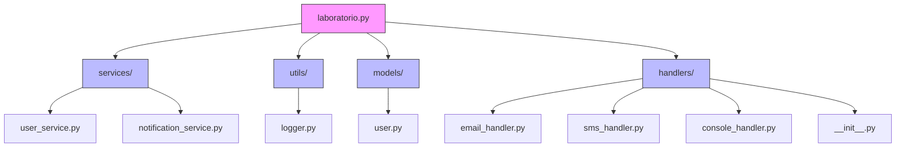
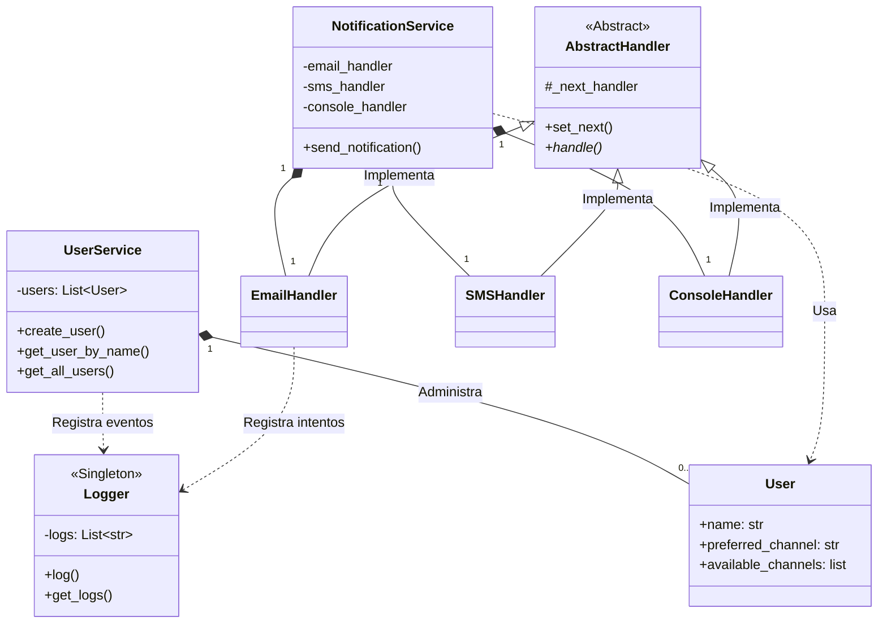
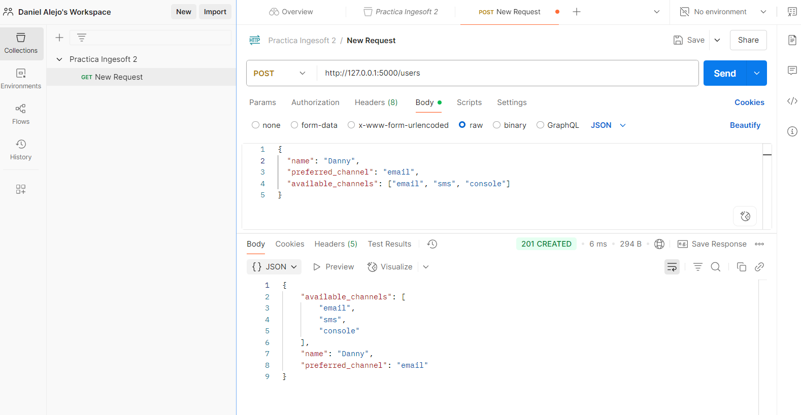
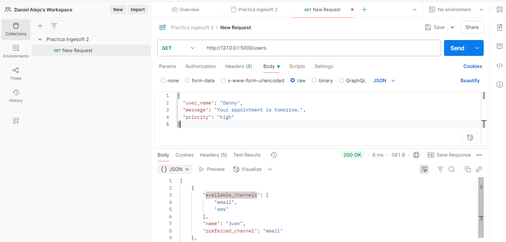
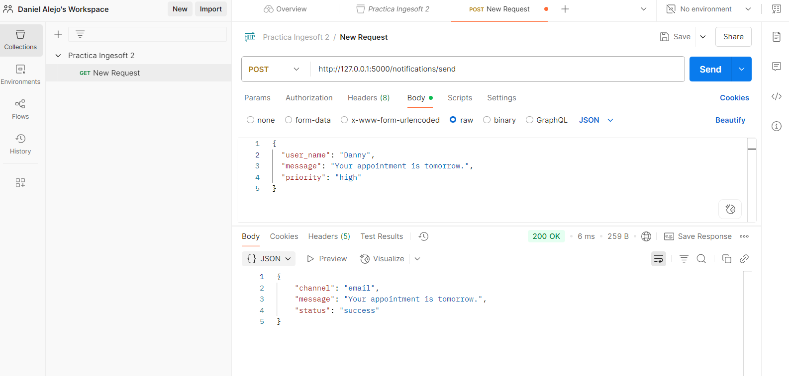
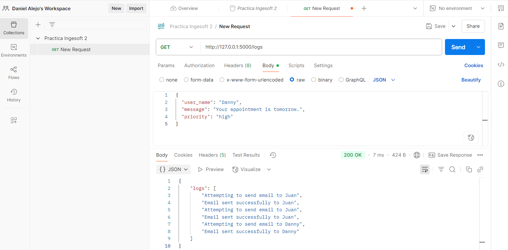

# Multichannel Notification System REST API

**Author:** Daniel Felipe Alejo Hurtado

---

## System Overview

This project implements a REST API in Flask for a multichannel notification system. Users can register with multiple communication channels (email, SMS, console), and notifications are sent trying first the preferred channel and then alternative channels using the Chain of Responsibility pattern and Singleton: For logging all notification attempts

---

## API Endpoints

### Base URL
```
http://127.0.0.1:5000

```

### 1. Register a User
- **POST** `/users`
- **Headers:**
  Authorization: <token>
- **Body (JSON):**
```json
{
  "name": "Danny",
  "preferred_channel": "email",
  "available_channels": ["email", "sms", "console"]
}
```
- **Response:**
  - `201 Created` 

### 2. List Users
- **GET** `/users`
- **Headers:**
- **Response:**
  - `200: description: List of users`

### 3. Send Notification
- **POST** `/notifications/send`
- **Headers:**
  Authorization: <token>
- **Body (JSON):**
```json
{
  "user_name": "Juan",
  "message": "Tu cita es mañana.",
  "priority": "high"
}
```
- **Response:**
  - `200: description: Notification status`
  - `404: description: User not found`
---

### 4. List logs
- **GET** `/logs`
- **Headers:**
- **Response:**
  - `200: description: list of logs`

## Class/Module Diagram

### dependency diagram



### Class Diagram



## Design Pattern Justifications

- **Chain of Responsibility:** Para intentar enviar notificaciones en cadena a través de múltiples canales hasta que uno funcione.  
- **Singleton:**  para registrar todos los intentos de notificación.  

---

## Installation and Running

### Requirements

- Python 3.x instalado
- flask

### Installation

```bash
git clone <repo_url>
cd api_danny
python -m venv env
source env/bin/activate      # En Windows: .\env\Scripts\activate
pip install -r requirements.txt
```

### Run the application
```bash
python -m laboratorio.app

```

### Swagger Documentation
Access the Swagger UI documentation at: http://127.0.0.1:5000/apidocs
---

## Curl Usage Examples

**Register a user:**
```bash
curl --location 'http://127.0.0.1:5000/users' \
--header 'Content-Type: application/json' \
--data '{
  "name": "Danny",
  "preferred_channel": "email",
  "available_channels": ["email", "sms"]
}'
```

**List users:**
```bash

curl --location --request GET 'http://127.    0.0.1:5000/users' \
--header 'Content-Type: application/json' \
--data '{  "user_name": "Danny",  "message": "Your appointment is tomorrow.    ",  "priority": "high"}'
```

**Send a notification:**
```bash 

curl --location 'http://127.0.0.1:5000/    notifications/send' \
--header 'Content-Type: application/json' \
--data '{  "user_name": "Danny",  "message": "Your appointment is tomorrow.    ",  "priority": "high"}'
```

**List logs:**
```bash
curl --location --request GET 'http://127.0.0.1:5000/logs' \
--header 'Content-Type: application/json' \
--data '{
  "user_name": "Danny",
  "message": "Your appointment is tomorrow.",
  "priority": "high"
}' 
```

### Using Postman
1. Open Postman and create a new request.
2. Set method (GET/POST) and URL (e.g., http://127.0.0.1:5000/users).
3. Add header Authorization: token.
4. For POST, add JSON body in the Body tab.
5. Click Send and see the response.

#### Register user



#### List users



#### Send notification



#### List logs



---